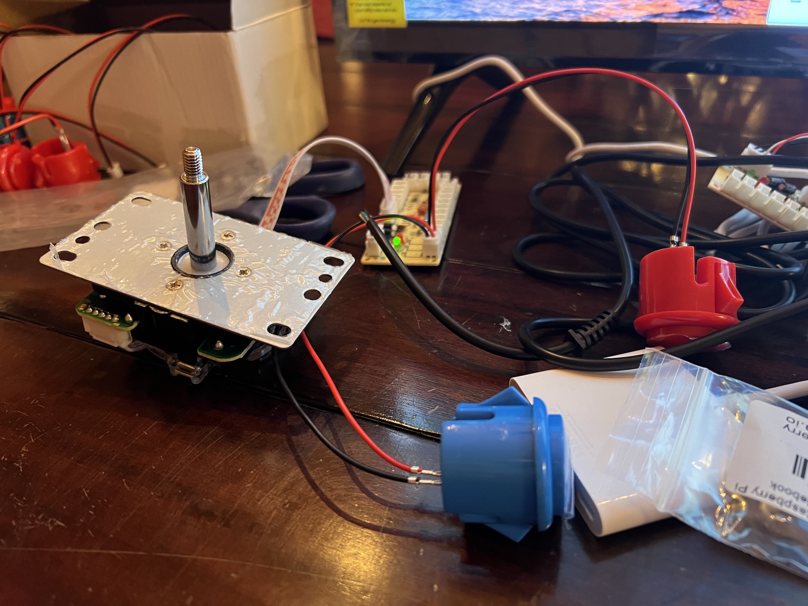

# Auth0 by Okta - DevDay Arcade Games

Lockman and Identity Invader games for Auth0 DevDay experience at Oktane 2023.

The game is written in JavaScript and packaged as an [Electron](https://www.electronjs.org/) desktop app.

## Building and publishing the game binaries

There is a GitHub action workflow (`.github/workflows/build.yml`) that builds and publishes binaries for Raspberry Pi, Windows, Linux and macOS. In order to trigger a new build a new tag needs to be pushed.

1. Update the `package.json` and bump the `version`. For example `3.0.0`
2. Run `npm install` to update `package-lock.json` 
3. Commit and create a tag `git tag v3.0.0`
4. Push the tags `git push && git push --tags` this will trigger the build and create a new release
5. Go to [release](https://github.com/auth0-developer-hub/devdays-arcade-games/releases) and find the draft release. Edit and publish.

## Installing and running the game binaries

### Raspberry PI 4B/400

1. Check the architecture of the Raspberry PI using `uname -m`
1. Download the `DevDay-Arcade-Games-x.x.x-y.AppImage` file from the latest [release](https://github.com/auth0-developer-hub/devdays-arcade-games/releases) to the Raspberry PI. Make sure to download the `arm64` or `armv7l` version based on the result from the previous step.
2. Run `chmod +x DevDay-Arcade-Games-x.x.x-y.AppImage`
3. Install FUSE if required: `sudo apt-get install libfuse2`
4. Start the games with `./DevDay-Arcade-Games-x.x.x-y.AppImage`

### Windows

1. Download the `DevDay-Arcade-Games-Setup-x.x.x.exe` file from the latest [release](https://github.com/auth0-developer-hub/devdays-arcade-games/releases) to the Windows machine.
2. Run the downloaded file.

## Local development setup

1. Install JS dependencies and run the app locally:

```
npm install
npm start
```

Builds can be created locally. But keep in mind that you can only build for the OS you are using. For example, you cannot build for Raspberry Pi from macOS and vice versa.

### Controls

For the joystick and buttons, keycode mapping needs to be done in three places.

1. **Welcome screen**: In `src/ui/script.js` change key values
   1. **Default**: `ArrowLeft` and `ArrowRight` to choose the game and `Enter` to select.
2. **Lockman**: In `src/ui/lockman/lockman.js` change the values for constants (`KEY_CODE_*`) at the start of the file
   1. **Default**: `ArrowLeft`, `ArrowRight`, `ArrowUp` and `ArrowDown` to navigate. `Space` to start game and `Enter` to go back to the welcome screen.
3. **Identity invaders**: In `src/ui/invader/invader.js` change the values for constants (`KEY_CODE_*`) at the start of the file
   1. **Default**: `ArrowUp` and `ArrowDown` to select single or multiplayer. `ArrowLeft`, `ArrowRight` to navigate. `Space` to fire and `Enter` to go back to the welcome screen.

### Resolution

The game resolution can be changed in following places

- **Lockman**: Update height and width for `#lockman` in `src/ui/lockman/lockman.css`
- **Identity Invaders**: Update `CANVAS_WIDTH` & `CANVAS_HEIGHT` in `src/ui/invader/invader.js`

## Hardware Setup

In order to test this game on arcade cabinets provided by [Quality Arcades](https://www.qualityarcades.com/), the following hardware was purchased:

1. [TCL 32" Class 3-Series HD 720p LED Smart Roku TV](https://www.amazon.com/dp/B09YWT3P5Q) - $144.38
2. [PepperTech Digital Raspberry Pi 400 Desktop Computer Complete Value Pack](https://www.amazon.com/dp/B092TT72B2) - $134.82
3. Two joysticks, buttons, and relevant cables from Quality Arcades - $125

### TV

The most difficult part of setting up the TV is creating a Roku account. This is necessary to activate the HDMI1 port on the TV. Once the Roku account was created, you can add the HDMI 1 port to the main screen via **Settings** > **TV Inputs**. 

### Raspberry Pi

Connect the Raspberry Pi to the HDMI 1 port on the TV and connect the power cable. You can use the included keyboard and mouse to connect to the WiFi and update the OS. Configure the username and password as you see fit. Using the default login credentials included with the kit will make it easier for others to set up.

Follow the [Raspberry Pi 4 instructions](#raspberry-pi-4) to run the game. Blue button = Enter, Red button = Spacebar. 

You will need to Alt+Tab to the terminal to stop the game with Ctrl+C.

NOTE: If you need to start from scratch, you can use the [Raspberry Pi Imager](https://www.raspberrypi.org/software/) to flash the SD card. Select Raspberry Pi OS (64-bit) when doing so.

### Joysticks and Buttons

The joysticks have a 5-pin connector that needs to be connected to the USB joystick board. A 4-pin connector on the end of a USB cable plugs into a Raspberry Pi USB port. 

The buttons have a 2-pin connector that needs to be connected to the USB joystick board. Below is a photo of the connectors. You might notice that the blue button is connected to the corner opposite the USB cable, and the red button is next to it. 



The blue button is mapped to **Enter** and the red button is mapped to **Space**. The joystick is mapped to **ArrowLeft**, **ArrowRight**, **ArrowUp**, and **ArrowDown**. The text that's displayed for these controls can be changed. See the [Controls](#controls) section for more information. You can also examine [this pull request](https://github.com/oktadev/devdays-arcade-games/pull/2) to see how the text was changed for the joysticks and buttons.

Install [QJoyPad](https://wiki.debian.org/QJoyPad) to map the joysticks and buttons to keys. You can use the following commands to install it:

```bash
sudo apt install qjoypad
```

Then, launch QJoyPad from the games menu. This will put a video game controller icon in the top bar. Select it and you should see both joysticks listed. 

[Download joystick-layout.lyt](setup/joystick-layout.lyt) and import it. You should now be able to play the game with the joysticks and buttons. If this doesn't work, you can map things manually using the instructions below.

Toggle the joysticks and buttons to see what axis and buttons they map to in QJoyPad. Click on the joystick name, the button that flashes, and then the keyboard key you want to map it to.

The joystick should have its connector at the bottom when you map things. The layout file below expects this as well. If the arcade cabinet is set up differently, you'll need to change the mappings.

## Credits

- Lockman based on [github.com/daleharvey/pacman](https://github.com/daleharvey/pacman) (WTFPL licensed)
- Identity Invader based on [github.com/toivjon/html5-space-invaders](https://github.com/toivjon/html5-space-invaders) (MIT licensed)
